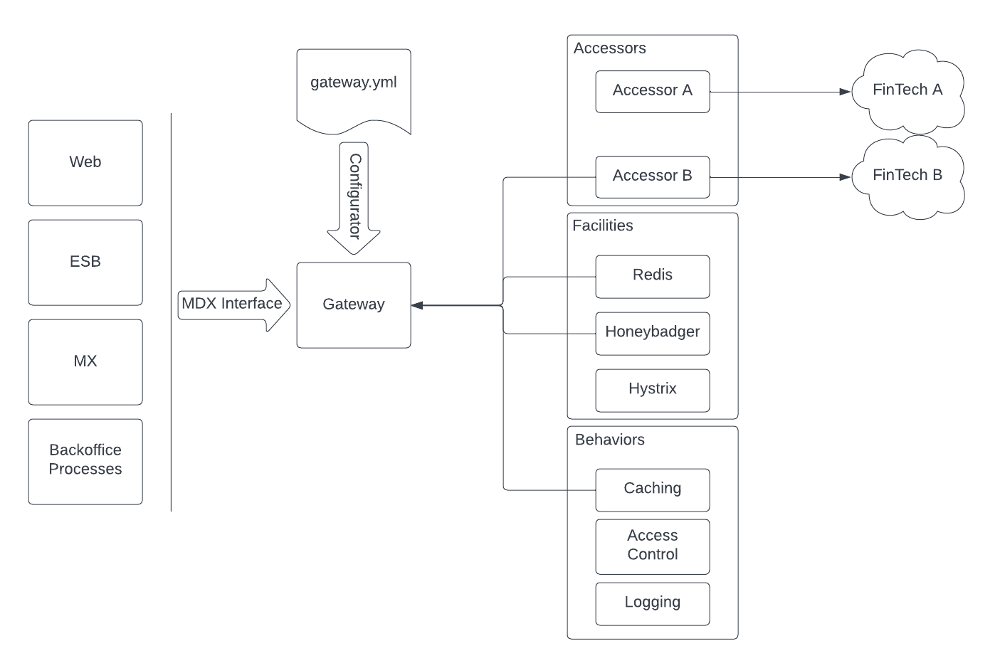

Issues: https://github.com/mxenabled/path-sdk/issues

# Path Accessor Practice

This repo is used for accessor construction demos and training.

## The Problem

The Super Fake Bank wants to have MXaccess and MXmobile. They have contracted with Hypothetical Tech to provide their 
banking services. In order for MX to provide the services, we need a way to talk directly to Hypothenical Tech's banking 
services, HypoFin. 

To demonstrate that we can successfully connect, we will build a small app that collects and sums the balances of
all of Super Fake bank's users.

The challenge:

* Create a Path Accessor that connects to HypoFin
* Wire the accessor into the Superfake Balances

## Terminology

`Path` is a framework that allows for fast creation of "adapter" code, called an accessor. The job of the accessor is
to translate the requests and responses from disparate systems into, in this case, MDX models and functions. This makes
the interaction between providers standard.

Any application that runs on the JVM can use a configuration file to tie together accessor implementations, along with
behaviors and facilities to create a clean programming interface.



`Facilities` provide operational support for the accessors and behaviors. By providing a simple implementation of an interface
the Path app can have access to key/value storage, encryption appliances, or exception reporting services. The accessors
don't need to change if it now needs to use Cassandra instead of Redis for session persistence, just swap out the
implementation class and configuration, and the app should continue to work.

`Behaviors` provide "cross-cutting concerns" like caching, access control, or access logging. They are implemented much
like Rails (Rack) middleware or Spring Boot filters. By implementing these separate from the accessors, we can keep the
accessor code focused on translating the disparate system protocols instead of managing cached accounts, for instance. 
It also allows them to be placed where needed, via configuration, independent of the accessor's implementation.

## Setup

### Install a JDK

You will need a JDK (at least version 8).

#### Check JDK

```
$ javac -version
```

If the version is as least 8, then you should be good.

If you get an error or your version is less than 8 (1.8), then you will need to install a JDK. There are several routes to go. Here are some suggestions:

_Direct install:_

Just download and install!

* [Zulu Open JDK](https://www.azul.com/downloads)
* [AdoptOpenJDK](https://adoptopenjdk.net)
* [Amazon Corretto Open JDK](https://aws.amazon.com/corretto)

_Java Version Manager:_

If you need (or may need) to use more than one version of the JDK, a Java Version Manager is suggested. Once installed,
you can install multiple versions of the JDK and easily switch between them.

* [Jabba](https://github.com/shyiko/jabba)

## Install Ruby

You will need ruby to run the HypoFin API... until we rewrite it :-).

We suggest installing a Ruby Version Manager:

* [RVM](https://rvm.io/)
* [RBEnv](https://github.com/rbenv/rbenv)

Once the Ruby Version Manager is installed, you will need ruby-2.7.5 installed.

## Build the project

Let's test out your setup. From the root of the project:

```shell
$ ./gradlew clean build run
```

You should see something like this (at the end of the output):

```shell
=========================================
Totals By Account Type
=========================================
  - SAVINGS: 18035.84
  - CHECKING: 395.96
  
BUILD SUCCESSFUL
```

(todo: Insert ruby project startup test here!)

If you see this, then you are ready to start!

Open: [./superfake-balances/src/main/java/superfake/Main.java](./superfake-balances/src/main/java/superfake/Main.java)

Here you will see some code that loads the gateway.yml and a users.yml. It uses `gateway` to log in as each user, 
get a list of their accounts and add the balances of all of their accounts to a ledger. After doing this for all users
the ledger contains the total balances of all accounts, by type. We then output each of the balances.

Now open: [./superfake-balances/src/main/resources/gateway.yml](./superfake-balances/src/main/resources/gateway.yml)

Look at the code that looks like this:
```yaml
accessor:
  class: superfake.StubAccessor
```

This code specifies the class to load as the accessor (the code that gets and translates the data). This is currently 
using a stub accessor that returns static data.

## Your challenge

Implement accessors that talk to provided HypoFin backend and replace the Stub accessors with your implementation by
changing [./superfake-balances/src/main/resources/gateway.yml](./superfake-balances/src/main/resources/gateway.yml).

You should NOT be modifying [./superfake-balances/src/main/java/superfake/Main.java](./superfake-balances/src/main/java/superfake/Main.java)!!!!!!
The code in Main should not need to change!

You should put your HypoFin accessors in `./hypofin-accessor/src/main/java/com/mx/hypothetical/hypofin/accessor`

After setting up the base accessor, modify [./superfake-balances/src/main/resources/gateway.yml](./superfake-balances/src/main/resources/gateway.yml)

From then on, you can run the following command to run the app against your code as you build it.

```shell
$ gradle build run
```

To help get you started, your base accessor should start out looking something like this:

```java
package com.mx.hypothetical.hypofin.accessor;

import com.mx.accessors.AccessorConfiguration;
import com.mx.accessors.BaseAccessor;
import com.mx.path.gateway.configuration.annotations.AccessorScope;
import com.mx.path.gateway.configuration.annotations.MaxScope;

@MaxScope(AccessorScope.SINGLETON)
public class Accessor extends BaseAccessor {
  public Accessor(AccessorConfiguration configuration) {
    super(configuration);
  }
}
```

The documentation for the HypoFin API is located here: [./hypofin-api/README.md](./hypofin-api/README.md)
